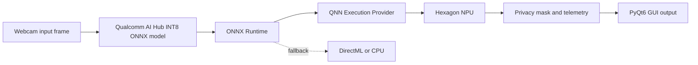

# Snapdragon Vision AI

[](https://www.microsoft.com/windows)
[](https://aihub.qualcomm.com/)
[](https://www.qualcomm.com/products/mobile/snapdragon/compute-platforms/snapdragon-x-series)
[](LICENSE)

## 🧭 Project Overview

**Snapdragon Vision AI** is a local webcam privacy and video analytics application for Snapdragon X Series HP PCs running Windows 11 ARM64. A quantized ONNX model runs through ONNX Runtime's Qualcomm QNN Execution Provider, allowing supported operations to execute on the Hexagon NPU close to the camera data.

By keeping inference on-device, the application avoids cloud round trips, reduces interactive latency, and limits exposure of camera frames. Detected regions are masked locally in real time and the processed feed is shown in a lightweight PyQt6 dashboard.

## 🏗️ Architecture



## ✨ Key Features

- **On-device Hexagon NPU acceleration** through the QNN Execution Provider.
- **Native ARM64 performance** for Snapdragon X Series HP PCs.
- **Zero-cloud privacy protection**: camera frames are processed locally.
- Live inference latency and FPS telemetry.
- Provider fallback to DirectML or CPU for development and unsupported configurations.
- Modular loader, video pipeline, and UI layers.

## 🧰 Prerequisites

- Snapdragon X Series HP PC with Windows 11 ARM64.
- ARM64-native Python 3.10 or newer. Confirm with `python -c "import platform; print(platform.machine())"` and expect `ARM64`.
- A Qualcomm AI Hub exported, quantized INT8 ONNX model with an output compatible with the sample decoder (`[N, 6]` or `[1, N, 6]`).
- Webcam access granted to Python.
- Qualcomm Neural Processing SDK/QNN runtime DLLs installed and discoverable by the process. Follow the QNN and ONNX Runtime QNN package instructions for your SDK version; the exact DLL set is version-specific.

## 🚀 Installation

### 1. Install ARM64 Python

Install the ARM64 build of Python for Windows, then create an isolated environment:

```powershell
py -3.11 -m venv .venv
.\.venv\Scripts\Activate.ps1
python -m pip install --upgrade pip
```

### 2. Install dependencies

The primary target is QNN. The `requirements.txt` file includes the QNN provider and comments the mutually exclusive DirectML alternative:

```powershell
python -m pip install -r requirements.txt
```

If your deployment uses a separately supplied QNN-enabled ONNX Runtime wheel, install that wheel in place of the package line in `requirements.txt`. Make sure the matching QNN SDK runtime DLLs, including `QnnHtp.dll`, are on `PATH` or in the application directory.

For a DirectML-only development machine, install the alternative provider instead:

```powershell
python -m pip uninstall onnxruntime-qnn
python -m pip install onnxruntime-directml
```

### 3. Launch

From the repository root, provide the path to the exported ONNX model:

```powershell
python -m src.app_ui --model .\models\vision_int8.onnx
```

Use `--cpu` to test the fallback path, or `--camera 1` for another webcam index:

```powershell
python -m src.app_ui --model .\models\vision_int8.onnx --cpu
```

## 📊 Hardware Benchmarks

The table below is a planning baseline for a Snapdragon X Series webcam workload, not a claim of a measured result. Record measurements on the exact HP SKU, model, resolution, and QNN SDK version before publishing final challenge results. Power draw should be captured with a calibrated external meter or platform telemetry.

| Execution backend | Latency (ms/frame) | FPS | Power draw |
| --- | ---: | ---: | ---: |
| CPU (ARM64) | Measure on target | Measure on target | Measure on target |
| Hexagon NPU (QNN) | Measure on target | Measure on target | Measure on target |

Suggested measurement command and reporting practice: run the same model for a warmed-up 60-second interval, exclude camera startup, report median and p95 latency, and record wall power under the same Windows power mode.

## 🗂️ Project Layout

```text
src/
  app_ui.py          # PyQt6 window and telemetry dashboard
  model_loader.py    # ORT session and provider selection
  video_pipeline.py  # Capture, preprocessing, inference, masking, FPS
requirements.txt
README.md
```

## 🧪 Development Notes

The sample decoder is intentionally conservative. Qualcomm AI Hub models can expose different output layouts, quantization scales, and post-processing contracts. Adapt `_decode_detections` for the exact exported model contract before production use, and validate numerical accuracy on representative camera footage.

The application uses `opencv-python-headless` because the GUI is provided by PyQt6. Do not install a second OpenCV wheel into the same environment.